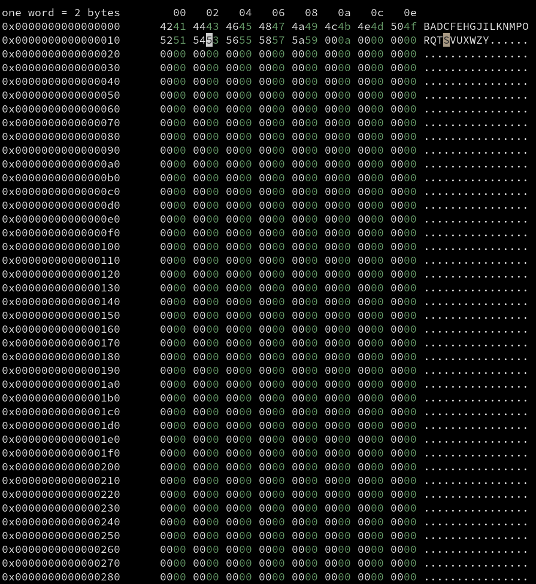

# Vex - a simple ncurses-based hex editor

## Build instructions

Vex uses the meson/ninja build system and depends on ncurses. Simply create
your release build directory using `meson --buildtype release build`, enter
the build directory and run `meson compile`. You should now have a freshly
built executable which you can run directly or install using `meson install`.

## Keybind list

Key | Description | Implemented?
--- | ----------- | ------------
hjkl | move left,down,up,right | yes
w | move to next word | yes
b | move to beginning of word | yes
e | move to end of word | yes
U | move one screen up | yes
D | move one screen down | yes
g | go to beginning of file | yes
G | go to end of file | yes
0 | go to beginning of line | yes
$ | go to end of line | yes
\+ | increase word size | yes
\- | decrease word size | yes
: | seek offset | no
m | set marker | yes
' | goto marker | yes
i | insert (prepend) | no
a | insert (append) | no
Esc | exit insert mode | no
s | substitute | no
r | replace | yes
